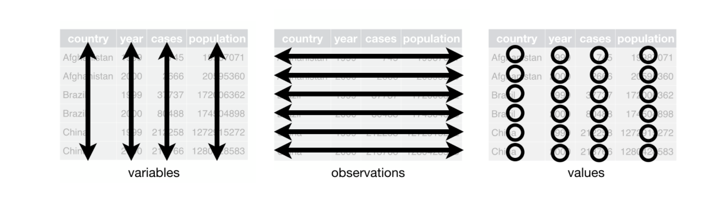

### About this repo 

- Machine learning organizations automate tasks to reduce costs or scale products. The output is the automation itself
achieved by collecting data, training models, and deploying them.

- This Project and notebooks are currently 'work in progress'. 

- It's inspired by [ML-From-Scratch](https://github.com/eriklindernoren/ML-From-Scratch), peter norvig's [pytudes project](https://github.com/norvig/pytudes#pytudes-index-of-jupyter-ipython-notebooks),
multiple Project's by folks like: [Made with ML](https://github.com/GokuMohandas/MadeWithML), [ML for Software Engineers](https://github.com/ZuzooVn/machine-learning-for-software-engineers), [Chris_albon](https://chrisalbon.com/) and many others. 

- Roadmap: It provides an opportunity to document some of my own learnings and acts as a [road map](https://github.com/asjad99/machine-learning-mindmap) for self-taught learners out there to learn data science for free. 

- [Computational notebooks](https://www.nature.com/articles/d41586-018-07196-1): Computational notebooks are essentially laboratory notebooks for scientific computing. We use Notebooks for Practice(as they are best suited for scientific computing). This is closely related to litrate programming paradigm(as conceived by Don Knuth) 

- This is a long list. see [this great article](https://towardsdatascience.com/how-to-become-a-data-scientist-2a02ed565336) on how to approach it depending on the [Career paths you decide to take](https://workera.ai/resource_downloads/ai_career_pathways/)

https://madewithml.com

----------------------------------------------------------------------------------------------------------------

## Predictive Analytics with Machine Learning 

## Topics: 
- [introduction](#Introduction)
- [ML Basic Theory:]
- [Data Acquizition]()
- [Data Wrangling Tools and Libraries]()
- [Exploratory Data Analysis](#Exploratory-Data-Analysis)
- [Data Cleaning](#Data-Cleaning)
- [Modeling]()
- [MLOPS]()
- [Cool Applications]()

#### Introduction

- Machine Learning is the modern probabilistic approach to artificial intelligence. It studies algorithms that learn to predict from (usually independent and identically distributed) data.
- It Utilizes past observation data to predict future observations. e.g Can we predict which products
that certain customer groups are more likely to purchase? 
- It also allows us to implement cool new feature like smart reply in gmail. 
- In terms of impact most of AI technologies currently being deployed are mostly falling under the category of machine learning. 
- Machine Learning Engineer: A machine learning engineer is someone who sits at the crossroads of data science and data engineering, and has proficiency in both data engineering and 
data science.

### Brief History of AI: 

  - [Artificial Intelligence and Machine Learning](https://www.youtube.com/watch?v=t4K6lney7Zw&list=PLUl4u3cNGP62uI_DWNdWoIMsgPcLGOx-V) 
  - [AI, Deep Learning, and Machine Learning: A Primer](https://a16z.com/2016/06/10/ai-deep-learning-machines/)
  - [For a programmers intro Welch Labs also has some great series on machine learning](https://youtu.be/i8D90DkCLhI)
  - [Peter Domingos ted talk](https://youtu.be/qIZ5PXLVZfo)

## Exploratory Data Analysis  

People are not very good at looking at a column of numbers or a whole spreadsheet and then determining important characteristics of the data. 
They find looking at numbers to be tedious, boring, and/or overwhelming.
Exploratory data analysis techniques have been devised as an aid in this situation. 
Most of these techniques work in part by hiding certain aspects of the data while making other aspects more clear.

Overall, The goal of exploratory analysis is to examine or explore the data and find relationships that weren’t previously known. 
Exploratory analyses explore how different measures might be related to each other but do not confirm that relationship as causitive. 

EDA always precedes formal (confirmatory) data analysis. 
 
EDA is useful for:

- Detection of mistakes
- Checking of assumptions
- Determining relationships among the explanatory variables
- Assessing the direction and rough size of relationships between explanatory
and outcome variables, 
- Preliminary selection of appropriate models of the relationship between an
outcome variable and one or more explanatory variables.

##### EDA Methods: 

- EDA method is either non-graphical or graphical. 
- Each method is either univariate or multivariate (usually just bivariate).
- Overall,the four types of EDA are univariate non-graphical, multivariate nongraphical, univariate graphical, and multivariate graphical.
- Non-graphical methods generally involve calculation of summary statistics, while graphical methods obviously summarize the data in a diagrammatic or pictorial way. 
- Univariate methods look at one variable (data column) at a time, while multivariate methods look at two or more variables at a time to explore relationships. Usually our multivariate EDA will be bivariate (looking at exactly two variables), but occasionally it will involve three or more variables. It is almost always a good idea to perform univariate EDA on each of the components of a multivariate EDA before performing the multivariate EDA.

We should always perform appropriate EDA before further analysis of our data. Perform whatever steps are necessary to become more familiar with your data, check for obvious mistakes,
learn about variable distributions, and learn about relationships between variables. EDA is not an exact science – it is a very important
art!

**Before EDA:** 

1. Check the size and type of data 
2. See if the data is in appropriate for  - Convert the data to a format you can easily manupulate (without changing the data itself)
3. Sample a test set, set it aside and never look at it 

**EDA:** 

1. Grab a copy of the data 
2. Document the EDA in a Jupyter notebook
3. Study Each Attribute and its characteristics (Name, Type, % of missing values, noisy, usefulness, type of distribution)
4. For Supervised Machine Learning, identify the target attribute 
5. Visualize the data
6. Study the correlations between attributes 
7. Study how you would solve the problem manually
8. Identify the promising transformations you may want to apply
9. make plans to collect more of different data (if needed and if possible)

#### Statistical knowledge required: 

(Expectation and Mean, Variance and Standard deviation, Covarriance and Correlation, Median Quartile, Interquartile range, Percentile/quantile,Mode  )

#### Visualization knowledge required: 
  knowing which methods are suitable for which type of data 

| Title            | Description | Code |
|---------------------|-------------|------|
| Univariate Non-Graphical Data Exploration    | Learn Exploratory data analysis using air pollution and temperature data for the city of Chicago          |  [Notebook](https://deepnote.com/project/8c259dff-61ed-46cb-aa94-fdda7d3fdc8e#%2Fdatascience-GYM%2FData_Munging%2F%5Bpandas%5DEDA_pollution.ipynb)    |
| Univariate Non-Graphical Data Exploration    | Data Exploration using data ozone levels dataset          | [Notebook](https://deepnote.com/project/8c259dff-61ed-46cb-aa94-fdda7d3fdc8e#%2Fdatascience-GYM%2FData_Munging%2F%5BPandas%5DEDA_ozone.ipynb)    |
| Graphical Data Exploration    | Data Exploration using visualization techniques        | [Notebook](https://deepnote.com/project/Data-Science-Journey-jCWd_2HtRsuqlP3afT_cjg/%2Fdatascience-GYM%2FData_Science%2F%5BEDA%5DUnivariate_mulitvariate_graphical.ipynb)    |

**Useful Guides:**

- [Chapter 4, Experimental Design and Analysis by Howard J. Seltman](http://www.stat.cmu.edu/~hseltman/309/Book/Book.pdf)
- [Section 1, Hands-On Exploratory Data Analysis with Python](https://www.packtpub.com/product/hands-on-exploratory-data-analysis-with-python/9781789537253)
- [Chapter 1, Practical Statistics for Data Scientists, 2nd Edition](https://learning.oreilly.com/library/view/practical-statistics-for/9781492072935/ch01.html) 

practice projects: https://github.com/ammarshaikh123/Projects-on-Data-Cleaning-and-Manipulation

----------------------------------------------------------------------------------------------------------------

## Data Cleaning: 

Real-world data is rarely clean and homogeneous. It is often said that 80% of data analysis is spent on the process of cleaning and preparing the data (Dasu and Johnson 2003). Data preparation is not just a first step, but must be repeated many over the course of analysis as new problems come to light or new data is collected

Data Formats should be easy for computers to parse, people to read and widely used by systems in production. 
The computations we perform must be reproducible and tweakable. 

**Key Data Cleaning Steps:** 

* Fix or remove outliers 
* Fill in missing values(e.g with zero, mean, median) or drop their rows  
* deal with corrupted/erronous  data
* (For ML) Feature Selection: Drop the attributes that provide no useful infomration for the task 

| Notebook            | Description | Code |
|---------------------|-------------|------|
| Data Cleaning       | Learn data cleaning with synthetic data | [Notebook](https://deepnote.com/project/8c259dff-61ed-46cb-aa94-fdda7d3fdc8e#%2Fdatascience-GYM%2FData_Munging%2F%5BPandas%5Ddata_cleaning.ipynb)|

### useful guides: 
- [Tidy data](http://vita.had.co.nz/papers/tidy-data.pdf) 
- [Reproducability in Data Science](https://maxmasnick.com/media/slides/data-analysis-reproducibility/data-analysis-reproducibility.pdf)
- Guide by Jeff lean on [how to share data with a statistician](https://github.com/asjad99/datascience-GYM/blob/master/Data_Munging/3.%20Data_Cleaning.ipynb)
- Best Practices in Data Cleaning: A Complete Guide to Everything You Need to Do Before and After Collecting Your Data
- Data Wrangling with Python by Jacqueline Kazil, Katharine Jarmul
- Clean Data by Megan Squire 
- Python Data Cleaning Cookbook - Modern techniques and Python tools to detect and remove dirty data and extract key insights
By: Michael Walker

----------------------------------------------------------------------------------------------------------------
#### Modeling

----------------------------------------------------------------------------------------------------------------
#### Introduction

### Notes:

https://github.com/asjad99/Machine-Learning-GYM/tree/main/ML_Notes 

### Projects

- Deep Reinforcement Learning based Clinical Decision Support for Sepsis treatment in emergency room  [[blog_post]](https://blog.asjadk.com/decision_support/) [[Paper]](https://link.springer.com/chapter/10.1007/978-3-030-91431-8_2) [[Code]](https://github.com/asjad99/MIMIC_RL_COACH)
- Memory Augmented Neural Networks for supporting business process execution [[blog_post]](https://blog.asjadk.com/deepprocess/) [[Paper]](https://link.springer.com/chapter/10.1007/978-3-030-91431-8_2) [[Code]](https://github.com/asjad99/DeepProcess)
- [Predictive Maintence] Predictive Maintenance (PdM) on IoT Data for Early Fault Detection w/ Delta Lake
- [Cross-Silo Process Mining with Federated Learning](https://scholar.google.com.au/citations?view_op=view_citation&hl=en&user=3dLAqxwAAAAJ&citation_for_view=3dLAqxwAAAAJ:u5HHmVD_uO8C)
- [Goal-Mining](https://github.com/asjad99/know-how-mining) - Mining goal refinement patterns: distilling know-how from data.

### Resources

https://github.com/asjad99/Machine-Learning-GYM/blob/main/readings.md
