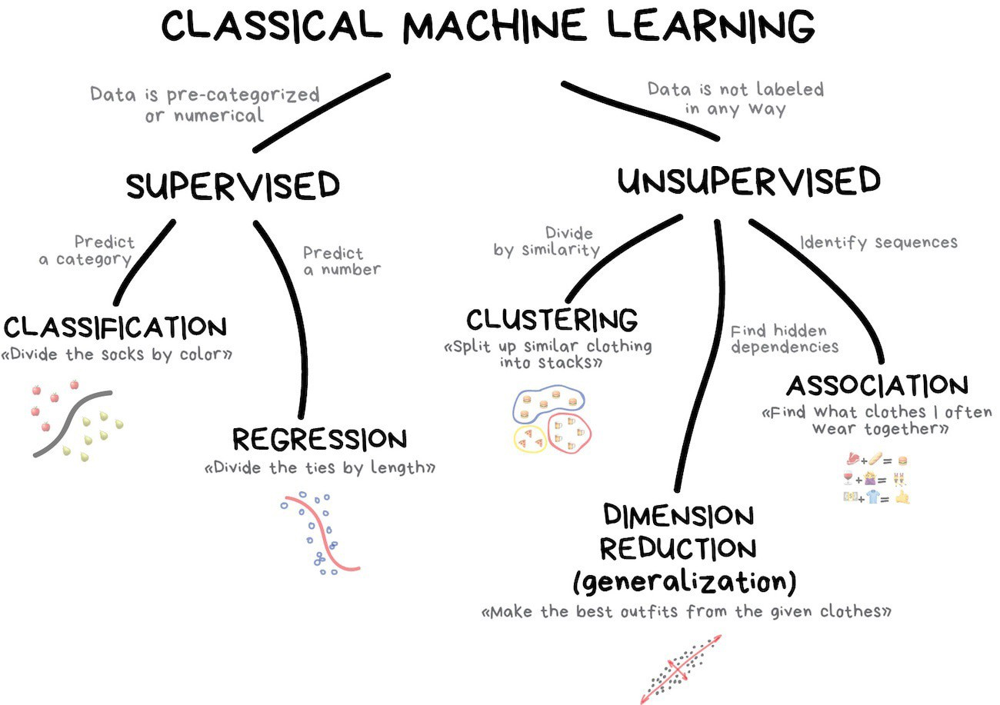
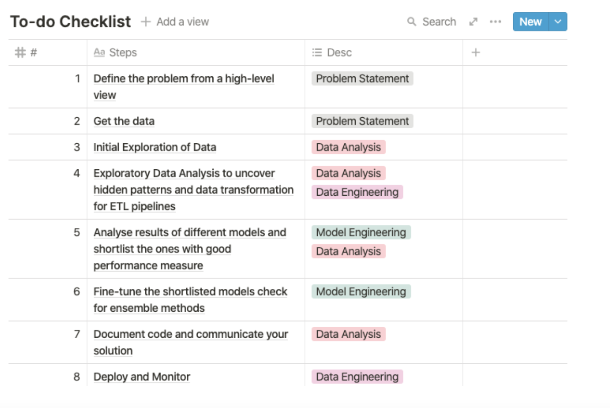
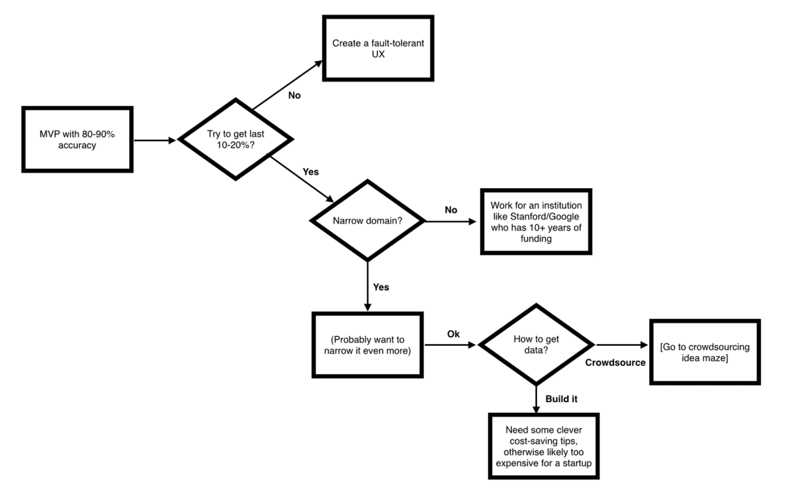

# About: 

- Machine learning organizations automate tasks to reduce costs or scale products. The output is the automation itself
achieved by collecting data, training models, and deploying them.

- This Project and notebooks are currently 'work in progress'. 

- It's inspired by [ML-From-Scratch](https://github.com/eriklindernoren/ML-From-Scratch), peter norvig's [pytudes project](https://github.com/norvig/pytudes#pytudes-index-of-jupyter-ipython-notebooks),
multiple Project's by folks like: [Made with ML](https://github.com/GokuMohandas/MadeWithML), [ML for Software Engineers](https://github.com/ZuzooVn/machine-learning-for-software-engineers), [Chris_albon](https://chrisalbon.com/) and many others. 

- Roadmap: It provides an opportunity to document some of my own learnings and acts as a [road map](https://github.com/asjad99/machine-learning-mindmap) for self-taught learners out there to learn data science for free. 

- [Computational notebooks](https://www.nature.com/articles/d41586-018-07196-1): Computational notebooks are essentially laboratory notebooks for scientific computing. We use Notebooks for Practice(as they are best suited for scientific computing). This is closely related to litrate programming paradigm(as conceived by Don Knuth) 

- This is a long list. see [this great article](https://towardsdatascience.com/how-to-become-a-data-scientist-2a02ed565336) on how to approach it depending on the [Career paths you decide to take](https://workera.ai/resource_downloads/ai_career_pathways/)

----------------------------------------------------------------------------------------------------------------

## Predictive Analytics with Machine Learning 

## Topics: 
- [introduction] 
- [ML Basic Theory:]
- [Data Acquizition]()
- [Data Wrangling Tools and Libraries]()
- [Exploratory Data Analysis](#Exploratory-Data-Analysis)
- [Data Cleaning](#Data-Cleaning)
- [ML Labs]()
- [ML In production]()
- [ML and NLP]()

Learning path recommended by Daniel Bourke: 

#### Machine Learning Introduction

- Machine Learning is the modern probabilistic approach to artificial intelligence. It studies algorithms that learn to predict from (usually independent and identically distributed) data.
- It Utilizes past observation data to predict future observations. e.g Can we predict which products
that certain customer groups are more likely to purchase? 
- It also allows us to implement cool new feature like smart reply in gmail. 
- In terms of impact most of AI technologies currently being deployed are mostly falling under the category of machine learning. 
- Machine Learning Engineer: A machine learning engineer is someone who sits at the crossroads of data science and data engineering, and has proficiency in both data engineering and 
data science.

### Brief History of AI: 

  - [Artificial Intelligence and Machine Learning](https://www.youtube.com/watch?v=t4K6lney7Zw&list=PLUl4u3cNGP62uI_DWNdWoIMsgPcLGOx-V) 
  - [AI, Deep Learning, and Machine Learning: A Primer](https://a16z.com/2016/06/10/ai-deep-learning-machines/)
  - [For a programmers intro Welch Labs also has some great series on machine learning](https://youtu.be/i8D90DkCLhI)
  - [Peter Domingos ted talk](https://youtu.be/qIZ5PXLVZfo)

----------------------------------------------------------------------------------------------------------------

###  Data Acquizition 

Note: automate as much as possible so you can easily get fresh data.

1. List the data you need and how much you need.
2. Find and document where you can get that data (identify what kind of data the organization has)
3. Check how much space it take and engineering efforts required (initial assessment). 
4. Understand Operational Constraints (e.g. what data is actually available at inference time)
5. Legal/Ethics/Privacy
6. Get access authorizations and check legal obligations 
7. proactively identify ethical risks, including how your work could be mis-used by harassers, trolls, authoritarian governments, or for propaganda/disinformation campaigns (and plan how to reduce these risks)
8. identify [potential biases and potential negative feedback loops]
9. Ensure sensitive Information is deleted or protected (e.g anonymized)

----------------------------------------------------------------------------------------------------------------

### Data Wrangling Tools and Libraries 

Data wrangling is about taking a messy or unrefined source of data and turning it into something useful. 
You begin by seeking out raw data sources and determining their value: How good are they as data sets? 
How relevant are they to your goal? Is there a better source? Once you’ve parsed and cleaned the data so that the data sets are usable, 
you can utilize tools and methods (like Python scripts) to help you analyze them and present your findings in a report. 
This allows you to take data no one would bother looking at and make it both clear and actionable.

Clean and wrangle data into a usable state

> Data engineers make sure the data the organization is using is clean, reliable, and prepped for whatever use cases may present themselves. 
Data engineers wrangle data into a state that can then have queries run against it by data scientists.

> Data Formats should be easy for computers to parse, people to read and widely used by systems in production. 
The computations we perform must be reproducible and tweakable. Data Pipelines need to be documented. 

#### Learning the tools 

| Notebook                 | Description | Code |
|--------------------------|-----------|------|
| Command-line             | Learn various unix command line utlities and how they can be used to clean and compute basic statistics          | [blog_post](https://asjadkhan.ghost.io/ghost/#/site) |     
| Web Data Collection      | Learn to collect data available on web (APIs or web scrapping)          | [Notebook](https://github.com/asjad99/datascience-GYM/tree/master/data_engineering)          |  
| numpy_Basics     | Learn the basics of the library that underpins scientific computing          |[Notebook](/work/datascience-GYM/Data_Munging/[Numpy]basics.ipynb)        | 
| numpy_linear_algebra     |           |Notebook        |     
| Pandas Basics            | Learn the basics of pandas        |[Notebook](https://github.com/asjad99/datascience-GYM/blob/master/Data_Munging/Pandas.ipynb)        |      |

Learn More: 
 
  - see our (data Engineering course)[https://github.com/asjad99/data-engineering-ml-ops/edit/main/README.md] to learn more 
  - [just-pandas-things](https://github.com/chiphuyen/just-pandas-things)

-------------------------------------------------------------------------------------------------------------------

## Guides on Python Programming

- How to think like a CS in python
- SCIP in python
- Hitch Hiker's Guide to python
- python env https://jacobian.org/2018/feb/21/python-environment-2018/
- Cheatsheet
- MIT Hacker tools
- [Python is Cool] https://github.com/chiphuyen/python-is-cool
- [Data Algorithms](https://github.com/asjad99/modern_algorithms_toolkit)   

-------------------------------------------------------------------------------------------------------------------

## Exploratory Data Analysis  

People are not very good at looking at a column of numbers or a whole spreadsheet and then determining important characteristics of the data. 
They find looking at numbers to be tedious, boring, and/or overwhelming.
Exploratory data analysis techniques have been devised as an aid in this situation. 
Most of these techniques work in part by hiding certain aspects of the data while making other aspects more clear.

Overall, The goal of exploratory analysis is to examine or explore the data and find relationships that weren’t previously known. 
Exploratory analyses explore how different measures might be related to each other but do not confirm that relationship as causitive. 

EDA always precedes formal (confirmatory) data analysis. 
 
EDA is useful for:

- Detection of mistakes
- Checking of assumptions
- Determining relationships among the explanatory variables
- Assessing the direction and rough size of relationships between explanatory
and outcome variables, 
- Preliminary selection of appropriate models of the relationship between an
outcome variable and one or more explanatory variables.

##### EDA Methods: 

- EDA method is either non-graphical or graphical. 
- Each method is either univariate or multivariate (usually just bivariate).
- Overall,the four types of EDA are univariate non-graphical, multivariate nongraphical, univariate graphical, and multivariate graphical.
- Non-graphical methods generally involve calculation of summary statistics, while graphical methods obviously summarize the data in a diagrammatic or pictorial way. 
- Univariate methods look at one variable (data column) at a time, while multivariate methods look at two or more variables at a time to explore relationships. Usually our multivariate EDA will be bivariate (looking at exactly two variables), but occasionally it will involve three or more variables. It is almost always a good idea to perform univariate EDA on each of the components of a multivariate EDA before performing the multivariate EDA.

We should always perform appropriate EDA before further analysis of our data. Perform whatever steps are necessary to become more familiar with your data, check for obvious mistakes,
learn about variable distributions, and learn about relationships between variables. EDA is not an exact science – it is a very important
art!

### EDA Summary: 

**Before EDA:** 

1. Check the size and type of data 
2. See if the data is in appropriate for  - Convert the data to a format you can easily manupulate (without changing the data itself)
3. Sample a test set, set it aside and never look at it 

**EDA:** 

1. Grab a copy of the data 
2. Document the EDA in a Jupyter notebook
3. Study Each Attribute and its characteristics (Name, Type, % of missing values, noisy, usefulness, type of distribution)
4. For Supervised Machine Learning, identify the target attribute 
5. Visualize the data
6. Study the correlations between attributes 
7. Study how you would solve the problem manually
8. Identify the promising transformations you may want to apply
9. make plans to collect more of different data (if needed and if possible)

#### Statistical knowledge required: 

(Expectation and Mean, Variance and Standard deviation, Covarriance and Correlation, Median Quartile, Interquartile range, Percentile/quantile,Mode  )

#### Visualization knowledge required: 
  knowing which methods are suitable for which type of data 

| Title            | Description | Code |
|---------------------|-------------|------|
| Univariate Non-Graphical Data Exploration    | Learn Exploratory data analysis using air pollution and temperature data for the city of Chicago          |  [Notebook](https://deepnote.com/project/8c259dff-61ed-46cb-aa94-fdda7d3fdc8e#%2Fdatascience-GYM%2FData_Munging%2F%5Bpandas%5DEDA_pollution.ipynb)    |
| Univariate Non-Graphical Data Exploration    | Data Exploration using data ozone levels dataset          | [Notebook](https://deepnote.com/project/8c259dff-61ed-46cb-aa94-fdda7d3fdc8e#%2Fdatascience-GYM%2FData_Munging%2F%5BPandas%5DEDA_ozone.ipynb)    |
| Graphical Data Exploration    | Data Exploration using visualization techniques        | [Notebook](https://deepnote.com/project/Data-Science-Journey-jCWd_2HtRsuqlP3afT_cjg/%2Fdatascience-GYM%2FData_Science%2F%5BEDA%5DUnivariate_mulitvariate_graphical.ipynb)    |

Useful Guides: 

- [Chapter 4, Experimental Design and Analysis by Howard J. Seltman](http://www.stat.cmu.edu/~hseltman/309/Book/Book.pdf)
- [Section 1, Hands-On Exploratory Data Analysis with Python](https://www.packtpub.com/product/hands-on-exploratory-data-analysis-with-python/9781789537253)
- [Chapter 1, Practical Statistics for Data Scientists, 2nd Edition](https://learning.oreilly.com/library/view/practical-statistics-for/9781492072935/ch01.html) 

practice projects: https://github.com/ammarshaikh123/Projects-on-Data-Cleaning-and-Manipulation

----------------------------------------------------------------------------------------------------------------

## Data Cleaning: 

Real-world data is rarely clean and homogeneous. It is often said that 80% of data analysis is spent on the process of cleaning and preparing the data (Dasu and Johnson 2003). Data preparation is not just a first step, but must be repeated many over the course of analysis as new problems come to light or new data is collected

Data Formats should be easy for computers to parse, people to read and widely used by systems in production. 
The computations we perform must be reproducible and tweakable. 

### Key Data Cleaning Steps: 

* Fix or remove outliers 
* Fill in missing values(e.g with zero, mean, median) or drop their rows  
* deal with corrupted/erronous  data
* (For ML) Feature Selection: Drop the attributes that provide no useful infomration for the task 

| Notebook            | Description | Code |
|---------------------|-------------|------|
| Data Cleaning       | Learn data cleaning with synthetic data | [Notebook](https://deepnote.com/project/8c259dff-61ed-46cb-aa94-fdda7d3fdc8e#%2Fdatascience-GYM%2FData_Munging%2F%5BPandas%5Ddata_cleaning.ipynb)|

### useful guides: 
- [Tidy data](http://vita.had.co.nz/papers/tidy-data.pdf) 
- [Reproducability in Data Science](https://maxmasnick.com/media/slides/data-analysis-reproducibility/data-analysis-reproducibility.pdf)
- Guide by Jeff lean on [how to share data with a statistician](https://github.com/asjad99/datascience-GYM/blob/master/Data_Munging/3.%20Data_Cleaning.ipynb)
- Best Practices in Data Cleaning: A Complete Guide to Everything You Need to Do Before and After Collecting Your Data
- Data Wrangling with Python by Jacqueline Kazil, Katharine Jarmul
- Clean Data by Megan Squire 
- Python Data Cleaning Cookbook - Modern techniques and Python tools to detect and remove dirty data and extract key insights
By: Michael Walker

----------------------------------------------------------------------------------------------------------------
### ML Theory: 

The ultimate goal of Machine learning is to be able to generatize to new unseen data. i.e predicting
behavior under new conditions. we study Problems like: Regression, Clustering, Classication, Recommendation. 

Machine Learning folks divide themselves in different tribes (popularized by peter domingos - Author of master algorithm)

> In tackling machine learning (and computer science in general) we face some deep philosophical questions. Questions like, “What does it mean to learn?” and, “Can a computer learn?” and, “How do you define simplicity?” and, “Why does Occam’s Razor work? (Why do simple hypotheses do well at modelling reality?)” In a very deep sense, learning theorists take these philosophical questions — or at least aspects of them — give them fleshy mathematical bodies, and then answer them with theorems and proofs. These fleshy bodies might have imperfections or they might only address one small part of a big question, but the more we think about them the closer we get to robust answers and, as a reader of this blog might find relevant, useful applications. But the glamorous big-picture stuff is an important part of the allure of learning theory.

Basics: 
- [MIT's Introduction to Machine Learning] ([https://openlearninglibrary.mit.edu/courses/course-v1:MITx+6.036+1T2019/course/])
- [DeepLearning book chapter 4]()
- [Andrew NG Course in ML]()

read more: 

- [PAC by j2kun](https://jeremykun.com/2014/01/02/probably-approximately-correct-a-formal-theory-of-learning/)
- [Understanding Generalizations in Machine Learning](https://www.asjadk.io/untitled-3/)
- [Why is ML hard](http://ai.stanford.edu/~zayd/why-is-machine-learning-hard.html)
- [Neural Networks](http://karpathy.github.io/neuralnets/) 
- [Feature Engineering and dimensionality reduction](https://learning.oreilly.com/library/view/feature-engineering-for/9781491953235/)
- [Machine Learning Mind Map](https://github.com/dformoso/machine-learning-mindmap) 

-----------------------------------------------------------
### ML Labs: 

#### General Process for Machine Learning Projects: 

#### Feature Engineering: 

Data Prep-Processing for Machine learning 
Note: Data Cleaning and EDA was covered earlier, the next step is pre-processing 

#### Algorithmic Modeling 

- According to J. Kolter at CMU:  

> for many data science problems, simple machine learning algorithms suffice to attain sufficiently good performance (by whatever metric you want to define performance, but I simply mean that they effectively solve the problem). The numbers here are all just examples (specifically the solvable/unsolvable ratio), but the point it gets at is important. There are many data science problems one would like to be able to solve, but in a large number of these cases, there is simply no way to solve the problem given the available data. For the set of problems that are solvable with some kind of machine learning, the vast majority will be solvable at least to a level of sufficient performance, using relatively simple models. The 5% of remaining problems is an important one, because they often consist of the most “interesting” problems from a research standpoint (think problems like speech recognition, natural language understanding, computer vision), but they are often not indicative of the types of problems one encounters in “most” data science applications.

| Algorithm           | Notebooks | Description |
|---------------------|-----------|-------------|
| Linear Regression   |           |             |
| Logistic Regression |           |             |
| SVMs                |           |             |
| XGboost             |           |             |
| Clustering          |           |             |

Introduction
K-Nearest-Neighbors and Handwritten Digit Classification
The Perceptron, and All the Things it Can’t Perceive
Decision Trees and Political Party Classification
Neural Networks and the Backpropagation Algorithm
K-Means Clustering and Birth Rates
Linear Regression
Eigenfaces, for Facial Recognition (via Principal Component Analysis)
Bandit Learning: the UCB1 Algorithm
Bandit Learning: the EXP3 Algorithm
Bandits and Stocks
Weak Learning, Boosting, and the AdaBoost Algorithm
Fairness in machine learning (introduction, statistical parity)
The Johnson-Lindenstrauss Transform
Singular Value Decomposition (motivation, algorithms)
Support Vector Machines (inner products, primal problem, dual problem)

### Bare-Bones

Implementing Machine Learning Concepts from scratch:

| Topic                          | Code | 
---------------------------------|------|
| Generalization and Regularization|     |
|  Hybrid-CI-System              | [Code](https://github.com/asjad99/Hybrid-CI-System) |
| Traveling Salesmen and gentic algorithms |  [Code](https://github.com/asjad99/Genetic-Algorithms) |  
| Neural Network                 |  [Code](https://github.com/asjad99/MLP) -A multi-layer Neural Network to solve the two spiral problem|

https://github.com/eriklindernoren/NapkinML

-----------------------------------------------------------

### ML in Production

> “MVP with 80–90% accuracy.” The old saying in the machine learning community is that “machine learning is really good at partially solving just about any problem.” For most problems, it’s relatively easy to build a model that is accurate 80–90% of the time. After that, the returns on time, money, brainpower, data etc. rapidly diminish. As a rule of thumb, you’ll spend a few months getting to 80% and something between a few years and eternity getting the last 20%. (Incidentally, this is why when you see partial demos like Watson and self-driving cars, the demo itself doesn’t tell you much — what you need to see is how they handle the 10–20% of “edge cases” — the dog jumping out in front of the car in unusual lighting conditions, etc).

- https://cdixon.org/2015/02/01/the-ai-startup-idea-maze

#### key resources: 

- [Debugging ML Systems by Andrew Ng](https://d2wvfoqc9gyqzf.cloudfront.net/content/uploads/2018/09/Ng-MLY01-13.pdf)
- Book: Building Machine Learning Powered Applications going from idea to Product
- Machine Learning Design Patterns: Solutions to Common Challenges in Data Preparation, Model Building, and MLOps
- [Challenges in Deploying Machine Learning: a Survey of Case Studies](https://arxiv.org/abs/2011.09926)
- [Challenges in Production](https://blog.acolyer.org/2019/10/07/150-successful-machine-learning-models/)

#### ML Applications: 
- [ML Applications Map](http://www.shivonzilis.com/)
- [ML Data Products]

----------------------------------------------------------------------------------------------------------------

## Deep Learning and Natural Language Processing

- Deep Learning and Brain: 

Topics: 

1. Know about standard architectures (MLP, vanilla RNN, LSTM (also see this blog), GRU, conv layers, resnets, attention mechanisms), 
2. common regularizers (weight decay, dropout)
3. Normalization (batch norm, layer norm, weight norm)
4. Optimizers (SGD, momentum SGD, Adam, others). 
5. the reparameterization trick 
6. Practice and Trends: https://www.youtube.com/watch?v=YJnddoa8sHk

Useful guides: 
  - [Deep Learning and neural networks](http://neuralnetworksanddeeplearning.com/)
  - [How neural networks work](https://omar-florez.github.io/scratch_mlp/)
  - [Deep Learning Nature Paper](https://www.nature.com/articles/nature14539)
  - [History of Deep Learning](https://www.asjadk.io/history-of-deep-learning/)

-----

### Quotes: 

> Humans are capable of far more than mapping immediate stimuli to immediate responses, as a deep network, or maybe an insect, would. We maintain complex, abstract models of our current situation, of ourselves, and of other people, and can use these models to anticipate different possible futures and perform long-term planning. We can merge together known concepts to represent something we’ve never experienced before—like picturing a horse wearing jeans, for instance, or imagining what we’d do if we won the lottery. This ability to handle hypotheticals, to expand our mental model space far beyond what we can experience directly—to perform abstraction and reasoning—is arguably the defining characteristic of human cognition. I call it extreme generalization: an ability to adapt to novel, never-before-experienced situations using little data or even no new data at all.

> Over the past decades computers have broadly automated tasks that programmers could describe with clear rules and algorithms. 
Modern machine learning techniques now allow us to do the same for tasks where describing the precise rules is much harder. - Jeff Bezos in his 2016 letter to Amazon shareholders:

> Almost all of AI’s recent progress is through one type, in which some input data (A) is used to quickly generate some simple response (B). Being able to 
input A and output B will transform many industries. The technical term for building this A→B software is supervised learning. These A→B systems have been
improving rapidly, and the best ones today are built with a technology called deep learning or deep neural networks, which were loosely inspired by the brain. - Andrew NG: 

> “But he also ascribes responsibility to two fundamental shifts, one on the supply side of computer research and programming, the other driven by demand, by what we expect computers to do. Norvig quotes MIT’s Hal Abelson who observed that computer science has changed from mathematical science to natural science, from calculating a correct answer to making observations, from traditional computer software to machine learning. 

Similarly, demand has shifted from expecting computers to perform well-defined tasks such as adding numbers to the type of more amorphous tasks we really care about, says Norvig: “Reading something interesting, getting the right recommendation, sharing pictures and knowing what’s in the picture—these are all AI tasks. There is not a set of definitive answers, there’s uncertainty, we want to optimize or make the best recommendations.”[1]

“In the 1970’s, the study of algorithms was added as an important component of theory. The emphasis was on making computers useful. Today, a fundamental change is taking place and the focus is more on applications. There are many reasons for this change. The merging of computing and communications has played an important role. The enhanced ability to observe, collect and store data in the natural sciences, in commerce, and in other fields calls for a change in our understanding of data and how to handle it in the modern setting. The emergence of the web and social networks as central aspects of daily life presents both opportunities and challenges for theory. While traditional areas of computer science remain highly important, increasingly re- searchers of the future will be involved with using computers to understand and extract usable information from massive data arising in applications, not just how to make computers useful on specific well-defined problems.

“Overall, machine learning systems can be thought of as a machine learning core — usually an advanced algorithm which requires a few chapters from Ian’s book to understand — surrounded by a huge amount of software engineering. The engineering can be shuffling around data, providing wrappers around inputs and outputs, or scheduling distributed code, all of which interface with the core as a black box. A machine learning advance happens when engineering effort plus research effort exceeds some threshold. Each incremental bit of engineering effort (such as decreasing Universe latencies) makes problems incrementally easier for our models, and has a chance to push the research over the finish line.” - source: https://blog.gregbrockman.com/define-cto-openai
